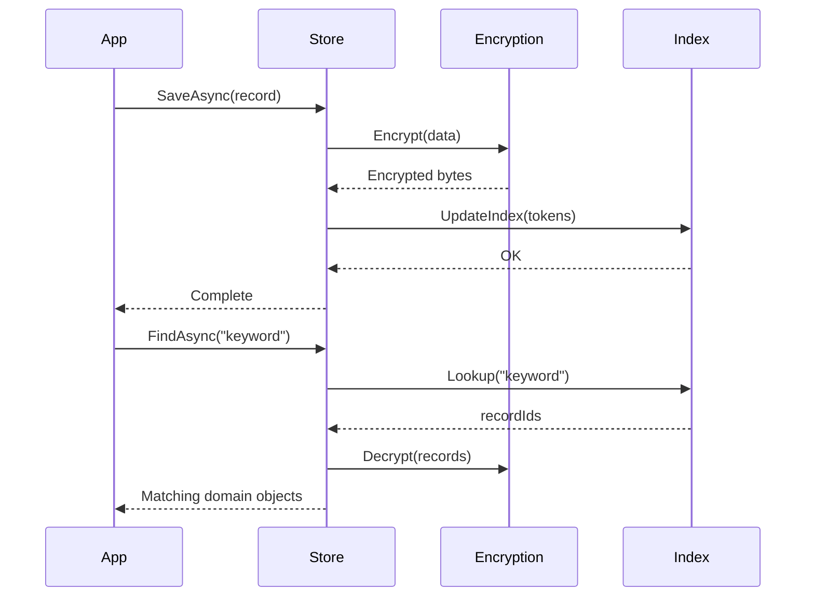

# Architecture

`Cabinet` is built on three simple ideas:

1. **Every operation is local** – no dependency on external databases or native libraries.
2. **Every byte is encrypted** – plaintext never touches disk.
3. **Every abstraction is replaceable** – storage, indexing, and encryption are all extensible.

It’s a secure, indexed, offline data layer for .NET that treats persistence as a first-class concern rather than a bolt-on.

## Core Components

### IOfflineStore

The entry point for saving, loading, and searching records.
It coordinates encryption, persistence, and index updates.

```csharp
public interface IOfflineStore
{
    Task SaveAsync<T>(string id, T data, IEnumerable<FileAttachment>? attachments = null);
    Task<T?> LoadAsync<T>(string id);
    Task DeleteAsync(string id);
    Task<IEnumerable<SearchResult>> FindAsync(string query);
    Task<IEnumerable<SearchResult<T>>> FindAsync<T>(string query);
}
```

The default implementation, `FileOfflineStore`, persists encrypted files to the local app data directory and maintains a shared encrypted index.

### IEncryptionProvider

Responsible for per-file encryption and decryption.
The default implementation, `AesGcmEncryptionProvider`, uses AES-256-GCM for confidentiality and integrity.

Each file key is derived using HKDF from a master key stored in `SecureStorage`.

```csharp
// Pseudocode
var masterKey = SecureStorage.GetAsync("Cabinet.MasterKey");
var fileKey = HKDF.Derive(masterKey, fileId);
```

This ensures:

* Each file uses a unique key.
* Master key compromise does not expose all files.
* The same master key can be safely rotated.

### IIndexProvider

Manages a lightweight, full-text inverted index.
Each token (word) maps to one or more record references.
Indexes are encrypted and persisted separately.

```plaintext
token → [recordId, recordId, …]
```

The default provider, `PersistentIndexProvider`, encrypts index data with the same `IEncryptionProvider`.

Search is O(1) for token lookup and O(n) for result assembly, with typical response times under 1 ms for thousands of records.

## Storage Layout

```tree
/AppData/
 ├── records/
 │    ├── {id}.dat        # Encrypted JSON
 │    ├── {id}.meta       # Encrypted metadata
 ├── attachments/
 │    ├── {id}-{filename}.bin
 ├── index/
 │    └── search.idx      # Encrypted inverted index
 └── summary/
      └── {year}.sum      # Encrypted summaries
```

Each `.dat` file stores one or more serialised domain objects.
Metadata and attachments follow the same encryption and atomic-write guarantees.

## Atomic Writes

All writes are transactional at the file level:

1. Data is written to `{filename}.tmp`
2. File is flushed and fsynced
3. `.tmp` is renamed to `.dat`

At no point does unencrypted or partially written data exist on disk.
If the process terminates mid-write, the temporary file is discarded on the next startup.

## Security Model

| **Concern**             | **Strategy**                                    |
| ------------------- | ------------------------------------------- |
| **Encryption**      | AES-256-GCM per file                        |
| **Integrity**       | GCM authentication tag                      |
| **Key Management**  | HKDF-derived keys from SecureStorage master |
| **Data at Rest**    | No plaintext written to disk                |
| **Key Rotation**    | Re-encrypt per file on rotation             |
| **Memory Handling** | Keys zeroed on disposal                     |
| **AOT Safety**      | No reflection, expression emission, or JIT  |

## Extensibility

You can bring your own implementation for any core service:

| Interface             | Purpose              | Example Extension                               |
| --------------------- | -------------------- | ----------------------------------------------- |
| `IEncryptionProvider` | Custom encryption    | Replace AES-GCM with XChaCha20                  |
| `IIndexProvider`      | Custom indexing      | Plug in Lucene.NET or vector embeddings         |
| `IStorageSerializer`  | Serialisation format | Swap JSON for MessagePack                       |
| `ITokenizer`          | Index parsing        | Custom language or domain-specific tokenisation |

Because everything is interface-based, you can add features such as compression, incremental backups, or remote mirroring without changing your domain logic.

## Lifecycle


